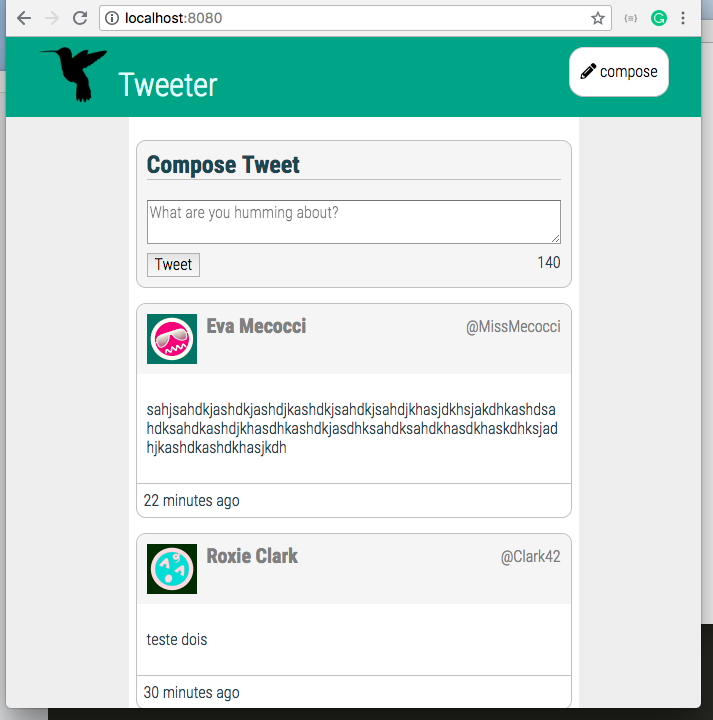
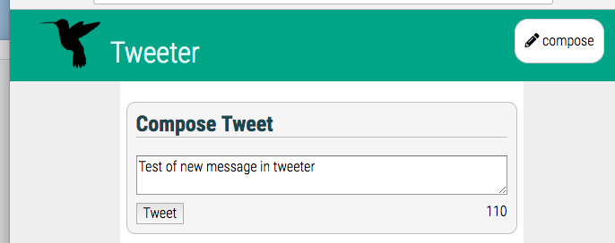
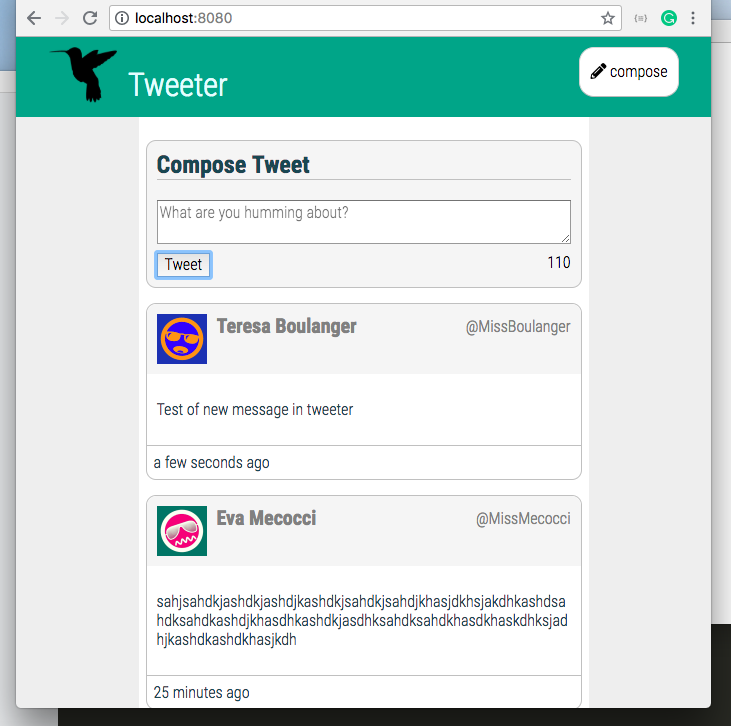

# Tweeter Project

Tweeter is a simple, single-page Twitter clone.

The front-end of This app was made with HTML, CSS, JavaScript, JQuery and AJAX;
The back-end was made with Node, Express and MongoDB.

## Getting Started

1. Fork this repository, then clone your fork of this repository.
2. Install dependencies using the `npm install` command.
3. Start the web server using the `npm run local` command. The app will be served at <http://localhost:8080/>.
4. Go to <http://localhost:8080/> in your browser.

PS: If you need or want to change the css style of the page, need to do this in the SASS folder and run
`npm run scss && npm run local` command before go to <http://localhost:8080/> in your browser.

## Dependencies

- Express
- Node 5.10.x or above
- Moment.js

## Screeshots

